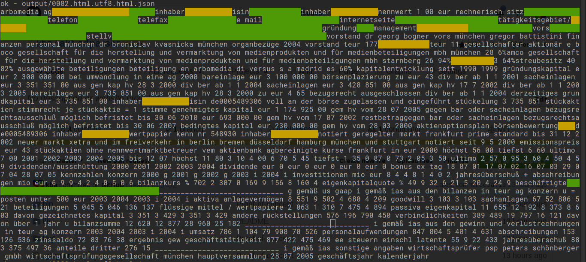

# akf-cdparser



```

$ ./bin/akf-html2json -p ./test/fixtures/html/2005/0007.html.utf8.html

{ wkn: 506660,
  isin: 'DE0005066609',
  street: 'Lorenzweg',
  street_number: '5',
  zip: '12099',
  city: 'Berlin',
  phone: '(030) 7 50 19-0',
  fax: '(030) 7 50 19-222',
  email: [ 'aap@aap.de' ],
  www: [ 'http://www.aap.de' ],
  established_year: 1990,
  aufsichtsrat: 
   [ { title: 'Jürgen ',
       firstName: 'W.',
       lastName: 'Krebs',
       city: 'Kilchberg (Schweiz)',
       funct: 'Vors.' },
     { title: 'Rubino ',
       firstName: 'Di',
       lastName: 'Girolamo',
       city: 'Oberaegeri (Schweiz)',
       funct: 'stellv. Vors.' },
     { title: 'Prof. ',
       firstName: 'Dr. Dr. med Reinhard',
       lastName: 'Schnettler',
       city: 'Hofheim/Ts.' } ] }

$ ./bin/akf-html2json ./test/fixtures/html/2005/0007.html.utf8.html

./test/fixtures/html/2005/0007.html.utf8.html -> output/0007.html.utf8.html.json

$ ./bin/akf-json-validate -p output/0007.html.utf8.html.json

ok - output/0007.html.utf8.html.json

$ ./bin/akf-json2sql -p output/0007.html.utf8.html.json

INSERT INTO "Aufsichtsrat" VALUES(506660, 'Krebs', 'W.', 'Jürgen ', 'Kilchberg (Schweiz)', NULL, '---', 0);
INSERT INTO "Aufsichtsrat" VALUES(506660, 'Girolamo', 'Di', 'Rubino ', 'Oberaegeri (Schweiz)', NULL, '---', 0);
INSERT INTO "Aufsichtsrat" VALUES(506660, 'Schnettler', 'Dr. Dr. med Reinhard', 'Prof. ', 'Hofheim/Ts.', NULL, '---', 0);

```
