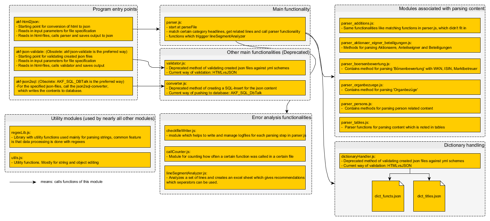

============

## Functionality in a nutshell
**akf-cdparser** serves the purpose to translate the 
html-files (Generated by *'Hoppenstedt_decoder'*) from the 
Hoppenstedt-Aktienführer CD's (1999-2015-further Versions).
It is part of the [Aktienführer-Datenarchiv work process][akf-link].

The files are parsed to categorized json-files, which can be then read by another tool, called [*akf-dbTools*][dbtools-link]. 
This tool does then the final step, it loads the json to the sql-database. The following diagram shows the basic workflow of the complete CD-parsing-project and also the position of akf-cdparser within that project.

## Installation 
Install [Node.js][node-link]

In command line, go to project folder and type: 

    npm install

The project was written in [Visual Studio Code][vscode-link], 
so if you are a developer it's recomended to use it.

## Commands to use akf-cdparser
  Usage: akf-html2json [options]

  Options:

    -h, --help                output usage information
    -o, --outputdir <dir>     Output directory
    -i, --inputdir <dir>      Input directory with html files
    -p, --print               Print to STDOUT
    -n, --parallel <num>      Parallel conversions
    -f, --inputfiles <files>  Input files
    -l, --lse                 do line segment analysis in the end

The standard for using the software is: 
    
    bin/node akf-html2json --inputfiles path\\to\\html\\file.html
	bin/node akf-html2json --inputdir   path\\to\\html\\directory

If you use visual-studio-code you can use the *launch.json* in *.vscode*-folder to run from vscode with specified parameters. It provides some basic examples which can be commented in. 

## Program overview 

The program consists of many modules. The following diagram shows the different modules, their main purpose and how they are basically connected.  

[akf-link]: https://digi.bib.uni-mannheim.de/aktienfuehrer/ "Aktienführer-Datenarchive work process"
[dbtools-link]: https://github.com/JKamlah/akf-dbTools
[node-link]: http://node.js/ "NodeJS"
[vscode-link]: https://code.visualstudio.com/ "VSCode"
